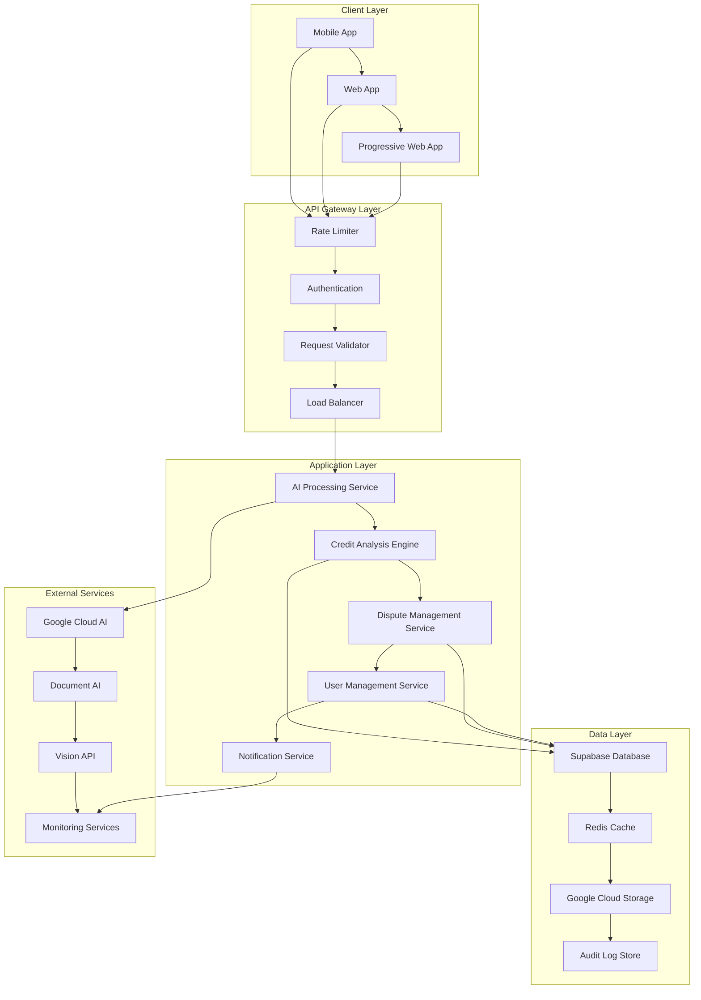

# Design Document: Comprehensive CreditAI Platform Improvements

## Overview

This design document outlines the technical architecture and implementation approach for comprehensive improvements to the CreditAI platform. The design addresses AI accuracy, performance, security, user experience, and infrastructure concerns through a systematic, modular approach that ensures scalability, maintainability, and reliability.

## Architecture

### High-Level System Architecture



### Component Architecture

#### 1. Enhanced AI Processing Pipeline

```typescript
interface AIProcessingPipeline {
  // Input validation and preprocessing
  inputValidator: FileValidator
  preprocessor: DocumentPreprocessor
  
  // Multiple processing engines
  ocrEngine: OCREngine
  documentAIEngine: DocumentAIEngine
  visionEngine: VisionEngine
  
  // Consensus and validation
  consensusEngine: ConsensusEngine
  confidenceCalculator: ImprovedConfidenceCalculator
  
  // Output processing
  dataStandardizer: DataStandardizer
  qualityValidator: QualityValidator
}
```

#### 2. Performance Optimization Layer

```typescript
interface PerformanceLayer {
  // Connection management
  aiModelPool: AIModelPool
  databasePool: DatabaseConnectionPool
  
  // Caching strategies
  redisCache: RedisCache
  applicationCache: ApplicationCache
  
  // Processing optimization
  parallelProcessor: ParallelPDFProcessor
  batchProcessor: BatchProcessor
  
  // Resource management
  resourceMonitor: ResourceMonitor
  loadBalancer: LoadBalancer
}
```

#### 3. Security Framework

```typescript
interface SecurityFramework {
  // Data protection
  piiMasker: EnhancedPIIMasker
  encryptionService: EncryptionService
  
  // Access control
  rateLimiter: RateLimiter
  authenticationService: AuthenticationService
  authorizationService: AuthorizationService
  
  // Monitoring and auditing
  auditLogger: AuditLogger
  securityMonitor: SecurityMonitor
  threatDetector: ThreatDetector
  
  // Validation
  inputValidator: InputValidator
  fileValidator: FileValidator
}
```

## Components and Interfaces

### 1. AI Accuracy Components

#### ImprovedConfidenceCalculator
```typescript
export class ImprovedConfidenceCalculator {
  static calculateConfidence(
    extractedData: CreditReportData,
    originalText: string,
    processingMethod: string
  ): ConfidenceResult {
    const weights = {
      textQuality: 0.25,
      dataExtraction: 0.35,
      structureRecognition: 0.20,
      contentValidation: 0.20
    }
    
    const scores = {
      textQuality: this.assessTextQuality(originalText),
      dataExtraction: this.assessExtractionQuality(extractedData, originalText),
      structureRecognition: this.assessStructureRecognition(originalText),
      contentValidation: this.assessContentValidation(extractedData, originalText)
    }
    
    const baseConfidence = Object.entries(weights)
      .reduce((total, [key, weight]) => total + scores[key] * weight, 0)
    
    const methodBonus = this.getProcessingMethodBonus(processingMethod)
    const minimumConfidence = this.determineMinimumConfidence(originalText)
    
    return {
      confidence: Math.max(minimumConfidence, Math.min(100, Math.round(baseConfidence + methodBonus))),
      breakdown: scores,
      method: processingMethod,
      minimumApplied: baseConfidence < minimumConfidence
    }
  }
}
```

#### CreditorDatabase
```typescript
export class CreditorDatabase {
  private static readonly CREDITOR_PATTERNS = new Map<string, CreditorInfo>([
    // Comprehensive database of creditors with fuzzy matching
    ['american express', { 
      name: 'American Express', 
      type: 'credit_card', 
      aliases: ['amex', 'americanexpress'],
      confidence: 0.95 
    }],
    // ... extensive creditor database
  ])
  
  static standardizeCreditorName(rawName: string): CreditorInfo {
    // Fuzzy matching algorithm with confidence scoring
    const normalized = rawName.toLowerCase().trim()
    
    // Direct match
    if (this.CREDITOR_PATTERNS.has(normalized)) {
      return { ...this.CREDITOR_PATTERNS.get(normalized)!, confidence: 1.0 }
    }
    
    // Fuzzy matching with Levenshtein distance
    const matches = this.findFuzzyMatches(normalized)
    return this.selectBestMatch(matches, rawName)
  }
}
```

### 2. Performance Components

#### AIModelPool
```typescript
export class AIModelPool {
  private static instance: AIModelPool
  private models: Map<string, AIModel> = new Map()
  private connectionPool: ConnectionPool
  
  async getModel(modelType: string): Promise<AIModel> {
    if (!this.models.has(modelType)) {
      await this.initializeModel(modelType)
    }
    
    return this.models.get(modelType)!
  }
  
  private async initializeModel(modelType: string): Promise<void> {
    const config = await this.getModelConfig(modelType)
    const model = await this.createModel(config)
    
    this.models.set(modelType, model)
    this.setupHealthCheck(modelType, model)
  }
}
```

#### ParallelPDFProcessor
```typescript
export class ParallelPDFProcessor {
  private readonly maxConcurrency = 3
  private readonly chunkSize = 5
  
  async processPages(pages: Buffer[]): Promise<ProcessingResult[]> {
    const chunks = this.chunkArray(pages, this.chunkSize)
    const semaphore = new Semaphore(this.maxConcurrency)
    
    const results = await Promise.all(
      chunks.map(async (chunk) => {
        await semaphore.acquire()
        try {
          return await this.processChunk(chunk)
        } finally {
          semaphore.release()
        }
      })
    )
    
    return this.mergeResults(results)
  }
}
```

### 3. Security Components

#### EnhancedPIIMasker
```typescript
export class EnhancedPIIMasker {
  private static readonly PATTERNS = {
    SSN: /\b\d{3}-?\d{2}-?\d{4}\b/g,
    ACCOUNT: /\b\d{4,20}\b/g,
    PHONE: /\b\d{3}-?\d{3}-?\d{4}\b/g,
    EMAIL: /\b[A-Za-z0-9._%+-]+@[A-Za-z0-9.-]+\.[A-Z|a-z]{2,}\b/g,
    ADDRESS: /\b\d+\s+[A-Za-z0-9\s,.-]+(?:Street|St|Avenue|Ave|Road|Rd|Drive|Dr|Lane|Ln|Boulevard|Blvd)\b/gi
  }
  
  static maskWithAudit(text: string, userId?: string, context?: string): MaskingResult {
    const result = this.maskPII(text)
    
    if (result.piiDetected && userId) {
      this.auditPIIDetection({
        userId,
        detectedTypes: result.detectedTypes,
        context,
        timestamp: new Date(),
        severity: this.calculateSeverity(result.detectedTypes)
      })
    }
    
    return result
  }
}
```

#### FileValidator
```typescript
export class FileValidator {
  private static readonly ALLOWED_TYPES = [
    'application/pdf',
    'image/jpeg',
    'image/png'
  ]
  
  private static readonly MAX_FILE_SIZE = 10 * 1024 * 1024 // 10MB
  
  static async validateFile(file: File): Promise<ValidationResult> {
    const validations = await Promise.all([
      this.validateFileType(file),
      this.validateFileSize(file),
      this.validateFileContent(file),
      this.validateFileSignature(file),
      this.scanForMalware(file)
    ])
    
    return this.combineValidationResults(validations)
  }
}
```

### 4. User Experience Components

#### ResponsiveCreditCard
```tsx
export function ResponsiveCreditCard({ 
  account, 
  onViewDetails 
}: ResponsiveCreditCardProps) {
  const { isMobile, isTablet } = useResponsive()
  const { theme } = useTheme()
  
  const cardVariants = {
    mobile: {
      layout: 'stacked',
      spacing: 'compact',
      interactions: 'touch-optimized'
    },
    desktop: {
      layout: 'grid',
      spacing: 'comfortable',
      interactions: 'hover-enabled'
    }
  }
  
  const variant = isMobile ? cardVariants.mobile : cardVariants.desktop
  
  return (
    <Card 
      className={cn(
        'transition-all duration-200',
        variant.layout === 'stacked' ? 'w-full' : 'hover:shadow-md',
        theme === 'dark' ? 'bg-gray-800' : 'bg-white'
      )}
    >
      <CardContent className={cn(
        variant.spacing === 'compact' ? 'p-4' : 'p-6'
      )}>
        {variant.layout === 'stacked' ? (
          <MobileLayout account={account} onViewDetails={onViewDetails} />
        ) : (
          <DesktopLayout account={account} onViewDetails={onViewDetails} />
        )}
      </CardContent>
    </Card>
  )
}
```

#### GuidedDisputeWizard
```tsx
export function GuidedDisputeWizard({ 
  negativeItems, 
  onSubmitDispute 
}: GuidedDisputeWizardProps) {
  const [currentStep, setCurrentStep] = useState(0)
  const [selectedItems, setSelectedItems] = useState<string[]>([])
  const [disputeReasons, setDisputeReasons] = useState<Record<string, string>>({})
  
  const steps = [
    {
      id: 'select',
      title: 'Select Items',
      description: 'Choose which items to dispute',
      component: SelectItemsStep,
      validation: () => selectedItems.length > 0
    },
    {
      id: 'reasons',
      title: 'Dispute Reasons',
      description: 'Tell us why each item is incorrect',
      component: DisputeReasonsStep,
      validation: () => selectedItems.every(id => disputeReasons[id])
    },
    {
      id: 'review',
      title: 'Review & Submit',
      description: 'Review your disputes before submitting',
      component: ReviewStep,
      validation: () => true
    }
  ]
  
  return (
    <WizardContainer>
      <ProgressIndicator steps={steps} currentStep={currentStep} />
      <StepContent 
        step={steps[currentStep]} 
        data={{ selectedItems, disputeReasons, negativeItems }}
        onChange={{ setSelectedItems, setDisputeReasons }}
      />
      <NavigationControls 
        steps={steps}
        currentStep={currentStep}
        onNext={() => setCurrentStep(prev => prev + 1)}
        onPrevious={() => setCurrentStep(prev => prev - 1)}
        onSubmit={() => onSubmitDispute(selectedItems, disputeReasons)}
      />
    </WizardContainer>
  )
}
```

## Data Models

### Enhanced Credit Data Model
```typescript
interface EnhancedCreditReportData {
  // Core data
  id: string
  userId: string
  createdAt: string
  updatedAt: string
  
  // Processing metadata
  processingMetadata: {
    method: ProcessingMethod
    confidence: ConfidenceResult
    processingTime: number
    version: string
  }
  
  // Personal information
  personalInfo: {
    name: string
    address: string
    ssn?: string
    dateOfBirth?: string
    aliases?: string[]
  }
  
  // Credit scores with enhanced metadata
  creditScores: {
    [bureau: string]: {
      score: number
      date: string
      model: string
      factors: ScoreFactor[]
      trend: ScoreTrend
    }
  }
  
  // Enhanced account information
  accounts: EnhancedCreditAccount[]
  
  // Negative items with dispute potential
  negativeItems: EnhancedNegativeItem[]
  
  // Credit inquiries
  inquiries: CreditInquiry[]
  
  // Public records
  publicRecords: PublicRecord[]
  
  // Data quality indicators
  dataQuality: {
    completeness: number
    accuracy: number
    consistency: number
    freshness: number
  }
  
  // Analysis results
  analysis: {
    riskFactors: RiskFactor[]
    recommendations: Recommendation[]
    disputeOpportunities: DisputeOpportunity[]
    scoreImpactPredictions: ScoreImpactPrediction[]
  }
}
```

### Processing Pipeline Model
```typescript
interface ProcessingPipeline {
  id: string
  userId: string
  fileId: string
  status: ProcessingStatus
  steps: ProcessingStep[]
  results: ProcessingResult[]
  errors: ProcessingError[]
  metadata: ProcessingMetadata
}

interface ProcessingStep {
  id: string
  name: string
  status: StepStatus
  startTime: string
  endTime?: string
  duration?: number
  input: any
  output?: any
  error?: ProcessingError
}
```

## Error Handling

### Comprehensive Error Handling Strategy

```typescript
export class ErrorHandler {
  static handle(error: Error, context: ErrorContext): ErrorResponse {
    // Classify error type
    const errorType = this.classifyError(error)
    
    // Mask sensitive information
    const maskedError = this.maskSensitiveData(error, context)
    
    // Log error with appropriate level
    this.logError(maskedError, errorType, context)
    
    // Generate user-friendly response
    const userResponse = this.generateUserResponse(errorType, context)
    
    // Trigger alerts if necessary
    if (this.isCriticalError(errorType)) {
      this.triggerAlert(maskedError, context)
    }
    
    return userResponse
  }
  
  private static classifyError(error: Error): ErrorType {
    if (error instanceof ValidationError) return ErrorType.VALIDATION
    if (error instanceof SecurityError) return ErrorType.SECURITY
    if (error instanceof PerformanceError) return ErrorType.PERFORMANCE
    if (error instanceof AIProcessingError) return ErrorType.AI_PROCESSING
    return ErrorType.UNKNOWN
  }
}
```

### Error Recovery Mechanisms

```typescript
export class ErrorRecovery {
  static async recoverFromProcessingError(
    error: ProcessingError,
    context: ProcessingContext
  ): Promise<RecoveryResult> {
    const strategies = [
      this.retryWithBackoff,
      this.fallbackToAlternativeMethod,
      this.partialProcessing,
      this.manualReview
    ]
    
    for (const strategy of strategies) {
      try {
        const result = await strategy(error, context)
        if (result.success) {
          return result
        }
      } catch (recoveryError) {
        this.logRecoveryAttempt(strategy.name, recoveryError)
      }
    }
    
    return { success: false, requiresManualIntervention: true }
  }
}
```

## Testing Strategy

### Test Architecture

```typescript
interface TestSuite {
  // Unit tests
  unitTests: {
    aiComponents: AIComponentTests
    securityComponents: SecurityComponentTests
    performanceComponents: PerformanceComponentTests
    uiComponents: UIComponentTests
  }
  
  // Integration tests
  integrationTests: {
    apiIntegration: APIIntegrationTests
    databaseIntegration: DatabaseIntegrationTests
    externalServiceIntegration: ExternalServiceTests
    endToEndWorkflows: E2EWorkflowTests
  }
  
  // Performance tests
  performanceTests: {
    loadTesting: LoadTests
    stressTesting: StressTests
    enduranceTesting: EnduranceTests
    scalabilityTesting: ScalabilityTests
  }
  
  // Security tests
  securityTests: {
    penetrationTesting: PenTests
    vulnerabilityScanning: VulnScans
    complianceTesting: ComplianceTests
    accessControlTesting: AccessControlTests
  }
}
```

### Test Data Management

```typescript
export class TestDataManager {
  static generateTestCreditReport(scenario: TestScenario): CreditReportData {
    const generators = {
      [TestScenario.PERFECT_CREDIT]: this.generatePerfectCreditReport,
      [TestScenario.POOR_CREDIT]: this.generatePoorCreditReport,
      [TestScenario.MIXED_CREDIT]: this.generateMixedCreditReport,
      [TestScenario.COMPLEX_DISPUTES]: this.generateComplexDisputeReport
    }
    
    return generators[scenario]()
  }
  
  static createMockProcessingPipeline(
    complexity: ProcessingComplexity
  ): MockProcessingPipeline {
    return {
      steps: this.generateProcessingSteps(complexity),
      expectedDuration: this.calculateExpectedDuration(complexity),
      potentialErrors: this.identifyPotentialErrors(complexity)
    }
  }
}
```

## Deployment Strategy

### Blue-Green Deployment

```typescript
interface DeploymentStrategy {
  // Environment management
  environments: {
    blue: Environment
    green: Environment
    staging: Environment
    development: Environment
  }
  
  // Deployment pipeline
  pipeline: {
    buildStage: BuildStage
    testStage: TestStage
    securityStage: SecurityStage
    deploymentStage: DeploymentStage
    validationStage: ValidationStage
  }
  
  // Rollback strategy
  rollback: {
    triggers: RollbackTrigger[]
    procedures: RollbackProcedure[]
    validation: RollbackValidation
  }
}
```

### Feature Flag Management

```typescript
export class FeatureFlags {
  private static flags = new Map<string, FeatureFlag>([
    ['improved-confidence-calculator', {
      enabled: false,
      rolloutPercentage: 0,
      conditions: ['user-tier:premium'],
      dependencies: ['ai-model-pool']
    }],
    ['enhanced-dispute-wizard', {
      enabled: false,
      rolloutPercentage: 10,
      conditions: ['mobile-user'],
      dependencies: ['improved-confidence-calculator']
    }]
  ])
  
  static isEnabled(flagName: string, context: FeatureContext): boolean {
    const flag = this.flags.get(flagName)
    if (!flag) return false
    
    return this.evaluateFlag(flag, context)
  }
}
```

## Monitoring and Observability

### Comprehensive Monitoring Stack

```typescript
interface MonitoringStack {
  // Application monitoring
  applicationMetrics: {
    performanceMetrics: PerformanceMetrics
    businessMetrics: BusinessMetrics
    errorMetrics: ErrorMetrics
    userMetrics: UserMetrics
  }
  
  // Infrastructure monitoring
  infrastructureMetrics: {
    serverMetrics: ServerMetrics
    databaseMetrics: DatabaseMetrics
    networkMetrics: NetworkMetrics
    storageMetrics: StorageMetrics
  }
  
  // Security monitoring
  securityMetrics: {
    accessMetrics: AccessMetrics
    threatMetrics: ThreatMetrics
    complianceMetrics: ComplianceMetrics
    auditMetrics: AuditMetrics
  }
  
  // Alerting system
  alerting: {
    rules: AlertRule[]
    channels: AlertChannel[]
    escalation: EscalationPolicy[]
  }
}
```

### Real-time Dashboards

```typescript
export class MonitoringDashboard {
  private metrics: MetricsCollector
  private alerts: AlertManager
  
  generateDashboard(type: DashboardType): Dashboard {
    const dashboards = {
      [DashboardType.EXECUTIVE]: this.createExecutiveDashboard(),
      [DashboardType.TECHNICAL]: this.createTechnicalDashboard(),
      [DashboardType.SECURITY]: this.createSecurityDashboard(),
      [DashboardType.BUSINESS]: this.createBusinessDashboard()
    }
    
    return dashboards[type]
  }
  
  private createExecutiveDashboard(): Dashboard {
    return {
      title: 'Executive Overview',
      widgets: [
        this.createUserSatisfactionWidget(),
        this.createSystemHealthWidget(),
        this.createBusinessMetricsWidget(),
        this.createSecurityStatusWidget()
      ],
      refreshInterval: 60000 // 1 minute
    }
  }
}
```

This comprehensive design provides the technical foundation for implementing all the improvements identified in the requirements. The modular architecture ensures that components can be developed and deployed independently while maintaining system cohesion and reliability.