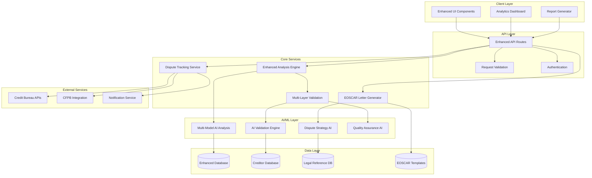
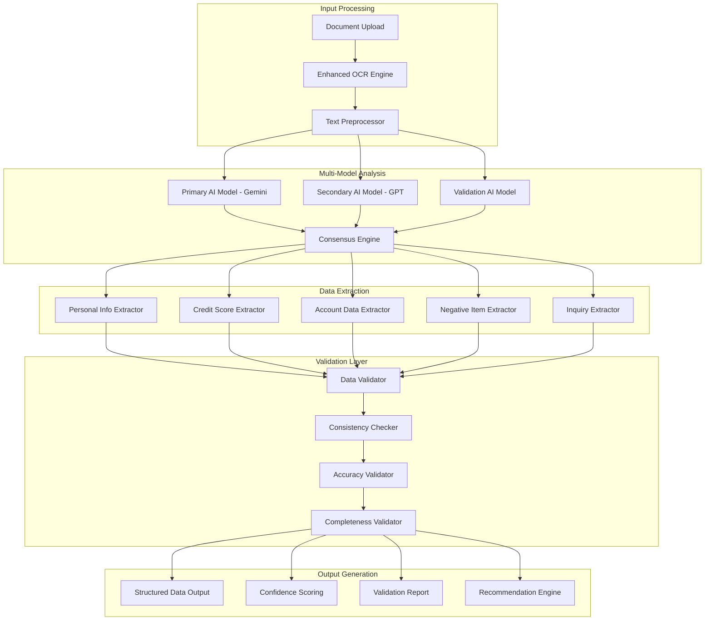

# Design Document

## Overview

The Enhanced Credit Analysis and EOSCAR Dispute System builds upon the existing credit analysis infrastructure to provide enterprise-grade credit report analysis with EOSCAR-compliant dispute letter generation. The system leverages advanced AI models, comprehensive validation systems, and standardized electronic formats to maximize dispute success rates and improve user outcomes.

EOSCAR (Electronic Online Solution for Complete and Accurate Reporting) is the industry-standard format used by credit bureaus for electronic dispute processing. By implementing EOSCAR compliance, disputes are processed faster and more accurately through automated bureau systems, significantly improving success rates compared to traditional paper-based disputes.

## Architecture

### High-Level System Architecture



### Enhanced Analysis Engine Architecture



## Components and Interfaces

### 1. Enhanced Analysis Engine

**Purpose:** Provides multi-model AI analysis with comprehensive validation

**Key Components:**
- `MultiModelAnalyzer`: Orchestrates multiple AI models for cross-validation
- `ConsensusEngine`: Combines results from multiple models using weighted voting
- `ValidationPipeline`: Multi-stage validation of extracted data
- `ConfidenceCalculator`: Calculates confidence scores based on multiple factors

**Interfaces:**
```typescript
interface EnhancedAnalysisEngine {
  analyzeReport(document: CreditReportDocument): Promise<EnhancedAnalysisResult>
  validateExtraction(data: CreditReportData): Promise<ValidationResult>
  calculateConfidence(analysis: AnalysisResult[]): number
  generateRecommendations(data: CreditReportData): Promise<DisputeRecommendation[]>
}

interface EnhancedAnalysisResult {
  extractedData: CreditReportData
  validationResult: ValidationResult
  confidenceScore: number
  recommendations: DisputeRecommendation[]
  qualityMetrics: QualityMetrics
  processingTime: number
}
```

### 2. EOSCAR Letter Generator

**Purpose:** Generates dispute letters in EOSCAR-compliant format

**Key Components:**
- `EOSCARFormatter`: Formats letters according to EOSCAR specifications
- `ReasonCodeMapper`: Maps dispute reasons to standardized EOSCAR codes
- `CreditorDatabase`: Maintains standardized creditor information
- `TemplateEngine`: Manages EOSCAR-compliant letter templates

**EOSCAR Format Specifications:**
- Header: Standard EOSCAR header with transmission information
- Consumer Information: Standardized personal identification block
- Dispute Items: Structured dispute item blocks with reason codes
- Supporting Documentation: Attachment references in EOSCAR format
- Footer: Standard EOSCAR footer with submission information

**Interfaces:**
```typescript
interface EOSCARLetterGenerator {
  generateLetter(dispute: DisputeRequest): Promise<EOSCARLetter>
  validateEOSCARCompliance(letter: EOSCARLetter): Promise<ComplianceResult>
  batchDisputes(disputes: DisputeRequest[]): Promise<EOSCARBatch>
  formatForBureau(letter: EOSCARLetter, bureau: CreditBureau): Promise<FormattedLetter>
}

interface EOSCARLetter {
  header: EOSCARHeader
  consumerInfo: EOSCARConsumerInfo
  disputeItems: EOSCARDisputeItem[]
  supportingDocs: EOSCARAttachment[]
  footer: EOSCARFooter
  rawContent: string
  complianceStatus: ComplianceStatus
}

interface EOSCARDisputeItem {
  itemType: string
  creditorCode: string
  accountNumber: string
  disputeReasonCode: string
  disputeDescription: string
  requestedAction: string
  supportingEvidence: string[]
}
```

### 3. Multi-Bureau Coordination System

**Purpose:** Coordinates disputes across all three credit bureaus

**Key Components:**
- `BureauCoordinator`: Manages multi-bureau dispute workflows
- `BureauSpecificFormatter`: Customizes letters for each bureau's requirements
- `ResponseTracker`: Tracks responses from all bureaus
- `ConsistencyAnalyzer`: Identifies discrepancies between bureau responses

**Bureau-Specific Configurations:**
- Experian: EOSCAR format with Experian-specific headers and addresses
- Equifax: EOSCAR format with Equifax-specific requirements
- TransUnion: EOSCAR format with TransUnion-specific formatting

**Interfaces:**
```typescript
interface MultiBureauCoordinator {
  coordinateDisputes(disputes: DisputeRequest[]): Promise<MultiBureauDispute>
  trackResponses(disputeId: string): Promise<BureauResponseStatus[]>
  analyzeConsistency(responses: BureauResponse[]): Promise<ConsistencyAnalysis>
  escalateDiscrepancies(analysis: ConsistencyAnalysis): Promise<EscalationPlan>
}

interface MultiBureauDispute {
  disputeId: string
  experianLetter?: EOSCARLetter
  equifaxLetter?: EOSCARLetter
  transunionLetter?: EOSCARLetter
  coordinationStrategy: CoordinationStrategy
  trackingInfo: DisputeTracking
}
```

### 4. Automated Tracking System

**Purpose:** Tracks dispute progress and automates follow-up actions

**Key Components:**
- `DisputeTracker`: Monitors dispute status and deadlines
- `ResponseAnalyzer`: Analyzes bureau responses and determines next steps
- `AutomationEngine`: Executes automated follow-up actions
- `NotificationManager`: Sends timely notifications to users

**Tracking Workflow:**
1. Dispute submission tracking with 30-day response timeline
2. Automated reminder system for approaching deadlines
3. Response analysis and next-step recommendations
4. Escalation to CFPB for non-responsive bureaus
5. Success verification and score impact tracking

**Interfaces:**
```typescript
interface AutomatedTrackingSystem {
  trackDispute(dispute: SubmittedDispute): Promise<TrackingRecord>
  analyzeResponse(response: BureauResponse): Promise<ResponseAnalysis>
  scheduleFollowUp(analysis: ResponseAnalysis): Promise<FollowUpPlan>
  escalateToRegulator(dispute: DisputeRecord): Promise<EscalationRecord>
}

interface TrackingRecord {
  disputeId: string
  submissionDate: Date
  responseDeadline: Date
  currentStatus: DisputeStatus
  nextActions: ScheduledAction[]
  escalationTriggers: EscalationTrigger[]
}
```

### 5. Enhanced Validation System

**Purpose:** Provides comprehensive validation of all data and processes

**Key Components:**
- `DataQualityValidator`: Validates extracted credit report data
- `EOSCARComplianceValidator`: Ensures EOSCAR format compliance
- `LegalComplianceValidator`: Validates legal references and requirements
- `QualityAssuranceEngine`: Provides overall quality scoring

**Validation Layers:**
1. **Data Extraction Validation**: Validates accuracy of extracted information
2. **Format Compliance Validation**: Ensures EOSCAR format compliance
3. **Legal Compliance Validation**: Validates legal references and requirements
4. **Quality Assurance Validation**: Overall quality and effectiveness scoring

**Interfaces:**
```typescript
interface EnhancedValidationSystem {
  validateExtraction(data: CreditReportData): Promise<ExtractionValidation>
  validateEOSCARCompliance(letter: EOSCARLetter): Promise<ComplianceValidation>
  validateLegalCompliance(dispute: DisputeRequest): Promise<LegalValidation>
  generateQualityReport(analysis: AnalysisResult): Promise<QualityReport>
}

interface ValidationResult {
  overallScore: number
  extractionQuality: number
  formatCompliance: number
  legalCompliance: number
  issues: ValidationIssue[]
  recommendations: string[]
}
```

## Data Models

### Enhanced Credit Report Data Model

```typescript
interface EnhancedCreditReportData {
  // Core data from existing model
  personalInfo: PersonalInfo
  creditScores: CreditScores
  accounts: CreditAccount[]
  negativeItems: NegativeItem[]
  inquiries: CreditInquiry[]
  publicRecords: PublicRecord[]
  
  // Enhanced fields
  extractionMetadata: ExtractionMetadata
  validationResults: ValidationResult[]
  qualityMetrics: QualityMetrics
  providerSpecificData: ProviderSpecificData
  crossReferenceData: CrossReferenceData
}

interface ExtractionMetadata {
  extractionTimestamp: Date
  aiModelsUsed: string[]
  confidenceScores: { [model: string]: number }
  processingTime: number
  documentQuality: DocumentQuality
}

interface QualityMetrics {
  dataCompleteness: number
  dataAccuracy: number
  consistencyScore: number
  validationScore: number
  overallQuality: number
}
```

### EOSCAR Data Models

```typescript
interface EOSCARHeader {
  transmissionId: string
  submissionDate: Date
  submitterInfo: SubmitterInfo
  bureauDestination: CreditBureau
  formatVersion: string
}

interface EOSCARConsumerInfo {
  firstName: string
  lastName: string
  middleName?: string
  suffix?: string
  ssn: string
  dateOfBirth: Date
  currentAddress: Address
  previousAddresses?: Address[]
  phoneNumbers: PhoneNumber[]
}

interface EOSCARDisputeItem {
  sequenceNumber: number
  itemType: EOSCARItemType
  creditorName: string
  creditorCode?: string
  accountNumber: string
  disputeReasonCode: EOSCARReasonCode
  disputeDescription: string
  requestedAction: EOSCARAction
  supportingDocuments: string[]
  originalBalance?: number
  currentBalance?: number
  dateOpened?: Date
  dateReported?: Date
}

enum EOSCARReasonCode {
  NOT_MINE = "01",
  INACCURATE_BALANCE = "02", 
  INACCURATE_PAYMENT_HISTORY = "03",
  ACCOUNT_CLOSED = "04",
  PAID_IN_FULL = "05",
  SETTLED = "06",
  OUTDATED = "07",
  DUPLICATE = "08",
  IDENTITY_THEFT = "09",
  MIXED_FILE = "10"
}

enum EOSCARAction {
  DELETE = "DELETE",
  UPDATE = "UPDATE", 
  VERIFY = "VERIFY",
  INVESTIGATE = "INVESTIGATE"
}
```

### Dispute Tracking Data Models

```typescript
interface DisputeRecord {
  id: string
  userId: string
  disputeItems: DisputeItem[]
  submissionMethod: SubmissionMethod
  bureauSubmissions: BureauSubmission[]
  trackingInfo: DisputeTracking
  responses: BureauResponse[]
  followUpActions: FollowUpAction[]
  status: DisputeStatus
  createdAt: Date
  updatedAt: Date
}

interface BureauSubmission {
  bureau: CreditBureau
  submissionDate: Date
  submissionMethod: SubmissionMethod
  trackingNumber?: string
  eoscarLetter: EOSCARLetter
  deliveryConfirmation?: DeliveryConfirmation
}

interface BureauResponse {
  bureau: CreditBureau
  responseDate: Date
  responseType: ResponseType
  outcome: DisputeOutcome
  updatedItems: UpdatedItem[]
  explanationLetter?: string
  nextSteps?: string[]
}

enum DisputeStatus {
  DRAFT = "DRAFT",
  SUBMITTED = "SUBMITTED", 
  IN_PROGRESS = "IN_PROGRESS",
  RESPONDED = "RESPONDED",
  PARTIALLY_RESOLVED = "PARTIALLY_RESOLVED",
  RESOLVED = "RESOLVED",
  ESCALATED = "ESCALATED",
  CLOSED = "CLOSED"
}
```

## Error Handling

### Comprehensive Error Handling Strategy

1. **Input Validation Errors**
   - Document format validation
   - File size and type restrictions
   - User input validation

2. **AI Processing Errors**
   - Model availability and timeout handling
   - Consensus engine failure recovery
   - Confidence threshold violations

3. **EOSCAR Compliance Errors**
   - Format validation failures
   - Required field missing errors
   - Bureau-specific requirement violations

4. **External Service Errors**
   - Credit bureau API failures
   - Notification service outages
   - Database connectivity issues

5. **Business Logic Errors**
   - Invalid dispute combinations
   - Timing constraint violations
   - Legal compliance failures

**Error Recovery Mechanisms:**
- Graceful degradation to single-model analysis
- Fallback to standard dispute letter format
- Retry mechanisms with exponential backoff
- User notification and manual intervention options

## Testing Strategy

### Multi-Layer Testing Approach

1. **Unit Testing**
   - Individual component testing
   - AI model response validation
   - EOSCAR format compliance testing
   - Data validation logic testing

2. **Integration Testing**
   - Multi-model consensus testing
   - End-to-end dispute workflow testing
   - Bureau coordination testing
   - Database integration testing

3. **Performance Testing**
   - Large document processing performance
   - Concurrent user load testing
   - AI model response time testing
   - Database query optimization testing

4. **Compliance Testing**
   - EOSCAR format validation testing
   - Legal compliance verification
   - FCRA requirement compliance testing
   - Privacy and security compliance testing

5. **User Acceptance Testing**
   - Real credit report processing testing
   - Dispute letter quality validation
   - User workflow testing
   - Success rate validation

### Test Data Strategy

- **Synthetic Credit Reports**: Generated test data covering all scenarios
- **Anonymized Real Data**: Sanitized real credit reports for validation
- **Edge Case Testing**: Unusual formats and error conditions
- **Bureau Response Simulation**: Mock bureau responses for testing

## Security Considerations

### Data Protection and Privacy

1. **PII Protection**
   - End-to-end encryption for all personal data
   - Tokenization of sensitive information
   - Secure data transmission protocols
   - Regular security audits

2. **Access Control**
   - Role-based access control (RBAC)
   - Multi-factor authentication
   - Session management and timeout
   - Audit logging for all access

3. **Compliance Requirements**
   - FCRA compliance for credit reporting
   - GDPR compliance for data protection
   - SOC 2 compliance for service organizations
   - Regular compliance assessments

4. **Secure Processing**
   - Secure AI model execution
   - Encrypted data storage
   - Secure API communications
   - Regular vulnerability assessments

## Performance Optimization

### Scalability and Performance

1. **AI Model Optimization**
   - Model caching and reuse
   - Parallel processing for multiple models
   - Optimized prompt engineering
   - Response caching for similar documents

2. **Database Optimization**
   - Indexed queries for fast retrieval
   - Connection pooling
   - Query optimization
   - Data archiving strategies

3. **Caching Strategy**
   - Redis caching for frequently accessed data
   - CDN for static assets
   - Application-level caching
   - Database query result caching

4. **Monitoring and Alerting**
   - Real-time performance monitoring
   - Error rate tracking
   - User experience monitoring
   - Automated alerting for issues

This design provides a comprehensive foundation for implementing enhanced credit analysis with EOSCAR-compliant dispute letters, ensuring high accuracy, legal compliance, and optimal user outcomes.